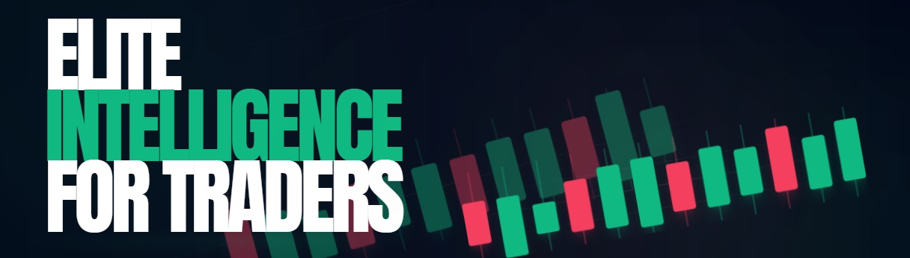

# A3 Elite Terminal

A professional-grade, real-time financial market terminal designed for high-performance market monitoring across Forex, Metals, Indices, Crypto, and Commodities.

## 🚀 Features

- **Real-Time Market Data**: Live price updates via WebSockets for low-latency monitoring.
- **Multi-Asset Support**: Comprehensive coverage of Forex Majors, Crosses, Metals (Gold, Silver, Platinum, Palladium), Global Indices, Cryptocurrencies, and Commodities.
- **Advanced Market Analysis**:
  - **DXY & Currency Indexes**: Real-time calculation of the US Dollar Index and other major currency strength indexes.
  - **Trading Sessions**: Visual tracking of Sydney, Tokyo, London, and New York sessions.

- **Interactive Charts**: High-performance TradingView charts for every asset.
- **Economic Calendar**: Real-time tracking of high-impact news events.
- **Responsive Design**: Optimized for both desktop and mobile trading environments.
- **Robust Data Pipeline**: Multi-source API integration with automatic failover

## 🚀 **CORE TRADING FEATURES**

### 1. **Multi-Asset Coverage (60+ Instruments)**
- **Forex Majors (7):** EUR/USD, GBP/USD, USD/JPY, USD/CHF, AUD/USD, USD/CAD, NZD/USD
- **Forex Crosses (12):** EUR/JPY, GBP/JPY, EUR/GBP, EUR/AUD, EUR/CHF, GBP/CHF, GBP/AUD, AUD/JPY, CHF/JPY, CAD/JPY, AUD/NZD, NZD/JPY
- **Precious Metals (4):** Gold (XAU/USD), Silver (XAG/USD), Platinum (XPT/USD), Palladium (XPD/USD)
- **Indices (9):** US30, NAS100, SPX500, UK100, GER40, FRA40, JPN225, AUS200, HK50
- **Cryptocurrencies (10):** BTC, ETH, BNB, XRP, SOL, ADA, DOT, MATIC, LINK, AVAX
- **Commodities (3):** US Oil (WTI), UK Oil (Brent), Natural Gas

---

## 📊 **ANALYSIS SUITE**
## 🎯 **SIGNAL GENERATION SYSTEM**
---

## 🔍 **ADVANCED FEATURES**
### **Multi-Pair Screener**
- Scan all Forex pairs (19 pairs)
- Scan all Crypto (10 pairs)
- Scan all Indices (9 pairs)
- Scan ALL markets (60+ pairs)
---
### **Economic Calendar**
### **Correlation Matrix** 
### **Performance Analytics** 
### **Market Heatmap** 
### **Live News Feed** 
### ##Alerts Manager** 
---
## 📱 **TELEGRAM INTEGRATION for MOBILE NOTIFICATION**
## 📒 **TRADE JOURNAL**
## 🤖 **AI CHART ANALYSIS**

## 📄 License

This project is licensed under the MIT License - see the [LICENSE](LICENSE) file for details.

---

Built with ❤️ for the trading community.
